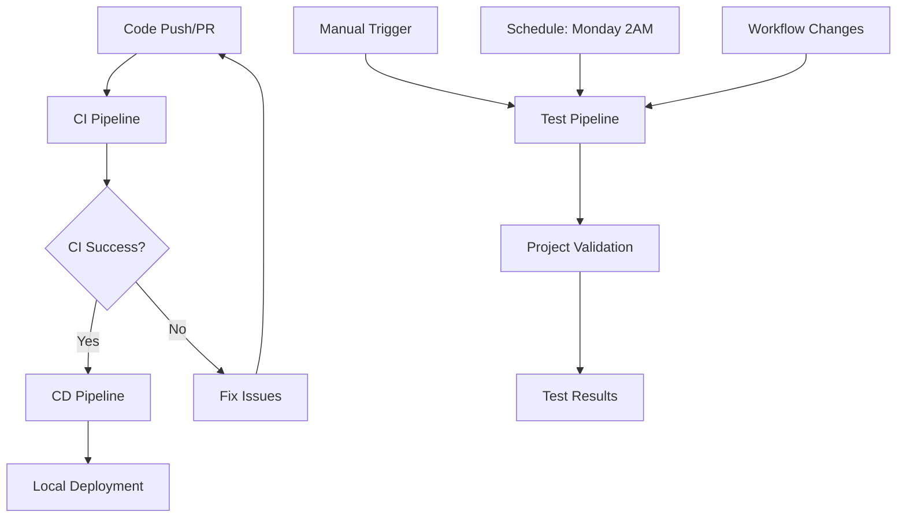

# 📚 Shipnet 2.0 CI/CD Pipeline Documentation

Welcome to the comprehensive documentation for Shipnet 2.0's CI/CD pipeline infrastructure. This repository contains three distinct pipelines designed to provide complete automation for development, testing, and deployment workflows.

## 📖 Documentation Index

### 🔄 [CI Pipeline Documentation](./CI-Pipeline-Documentation.md)
**Purpose:** Continuous Integration pipeline that builds, tests, and validates all code changes.

**Key Features:**
- Parallel builds for .NET backend and all 6 Next.js frontend apps
- Automated security vulnerability scanning
- Integration testing with PostgreSQL
- Comprehensive build artifact management
- Matrix strategy for efficient parallel processing

**When it runs:** On pushes to main/develop branches and pull requests

---

### 🚀 [CD Pipeline Documentation](./CD-Pipeline-Documentation.md)  
**Purpose:** Continuous Deployment pipeline that deploys applications to local development environment.

**Key Features:**
- Smart pre-deployment validation (port availability, disk space, process cleanup)
- Automated deployment of backend Azure Functions and all frontend apps
- Health monitoring and validation
- Rollback capabilities and detailed logging
- Self-hosted runner support for local deployment

**When it runs:** After successful CI pipeline completion or manual trigger

---

### 🧪 [Test Pipeline Documentation](./Test-Pipeline-Documentation.md)
**Purpose:** Comprehensive testing and validation pipeline for project health verification.

**Key Features:**
- Project structure and configuration validation
- Quick build tests without full compilation
- Unit and integration testing for all components
- Manual test type selection (structure, build, unit, integration, all)
- Detailed reporting with actionable recommendations

**When it runs:** Manual trigger, scheduled weekly, or on workflow changes

---

## 🏗️ Architecture Overview



## 🎯 Pipeline Interaction Matrix

| Pipeline | Triggers CI | Triggered by CI | Independent | Manual Trigger |
|----------|-------------|-----------------|-------------|----------------|
| **CI Pipeline** | ❌ | ❌ | ✅ | ❌ |
| **CD Pipeline** | ❌ | ✅ | ❌ | ✅ |
| **Test Pipeline** | ❌ | ❌ | ✅ | ✅ |

## 🔧 Technology Stack

### Backend (.NET Azure Functions)
- **.NET 8.0:** Modern framework with improved performance
- **Azure Functions Core Tools v4:** Local development and deployment
- **Entity Framework:** Database operations and migrations
- **PostgreSQL:** Database system for data persistence

### Frontend (Next.js Applications)
- **Node.js 20.x LTS:** JavaScript runtime
- **Next.js 15:** React framework with App Router
- **React 19:** Latest React with enhanced features  
- **Nx Workspace:** Monorepo management and build optimization
- **6 Applications:** chartering, registers, home, accounting, voyagemanager, auth

### DevOps Infrastructure
- **GitHub Actions:** CI/CD platform
- **Self-hosted Runners:** Local deployment capability
- **PowerShell:** Windows automation scripting
- **Ubuntu Latest:** CI/testing environment
- **Docker/PostgreSQL:** Database services for testing

## 📊 Application Port Configuration

| Application | Port | Purpose | Status |
|-------------|------|---------|---------|
| **Backend API** | 7071 | Azure Functions | ✅ Active |
| **Chartering** | 3001 | Charter Management | ✅ Active |
| **Registers** | 3002 | Registry Management | ✅ Active |
| **Home** | 3003 | Main Dashboard | ✅ Active |
| **Accounting** | 3004 | Financial Management | ✅ Active |
| **Voyagemanager** | 3005 | Voyage Operations | ✅ Active |
| **Auth** | 3006 | Authentication Service | ✅ Active |

## 🚀 Quick Start Guide

### 1. Running CI Pipeline
The CI pipeline runs automatically on code changes:

```bash
# Push to main, develop, or feature branches triggers CI
git push origin main

# Pull requests to main/develop also trigger CI
git checkout -b feature/new-feature
git push origin feature/new-feature
# Create PR to main or develop
```

### 2. Running CD Pipeline
The CD pipeline can be triggered automatically or manually:

**Automatic (after CI success):**
- CI pipeline completes successfully
- CD pipeline automatically starts deployment

**Manual trigger:**
1. Go to GitHub Actions
2. Select "CD Pipeline - Shipnet 2.0" 
3. Click "Run workflow"
4. Select environment (development/staging/production)

### 3. Running Test Pipeline
The test pipeline offers flexible execution options:

**Manual trigger with options:**
1. Go to GitHub Actions
2. Select "Test Pipeline - Shipnet 2.0"
3. Click "Run workflow"
4. Choose test type:
   - `all` - Complete test suite
   - `structure` - Project structure validation
   - `build` - Build validation only
   - `unit` - Unit tests only
   - `integration` - Integration tests only
5. Optionally specify target component

**Automatic triggers:**
- Every Monday at 2 AM (scheduled)
- On changes to workflow files or configuration

## 🔍 Monitoring and Troubleshooting

### Common Issues and Solutions

#### CI Pipeline Issues
- **Build Failures:** Check dependency versions and package-lock.json files
- **Test Failures:** Review test logs and verify database connectivity
- **Artifact Issues:** Ensure build outputs are generated correctly

#### CD Pipeline Issues  
- **Port Conflicts:** Verify ports 7071, 3001-3006 are available
- **Deployment Failures:** Check self-hosted runner status and permissions
- **Health Check Failures:** Verify applications start correctly and respond to requests

#### Test Pipeline Issues
- **Structure Validation:** Ensure all required files and directories exist
- **Build Validation:** Check for compilation errors and dependency issues
- **Integration Tests:** Verify PostgreSQL service starts correctly

### Monitoring Commands

```bash
# Check running processes on deployment ports
netstat -ano | findstr "3001 3002 3003 3004 3005 3006 7071"

# Monitor Azure Functions logs (if running locally)
func logs

# Check Node.js processes
Get-Process node | Where-Object { $_.ProcessName -eq "node" }
```

## 📈 Performance Metrics

### CI Pipeline Performance
- **Average Runtime:** 15-20 minutes
- **Parallel Jobs:** 8 (backend + 6 frontend apps + security)
- **Cache Hit Rate:** ~85% with npm/NuGet caching
- **Success Rate:** Target 95%+

### CD Pipeline Performance  
- **Average Deployment:** 10-15 minutes
- **Health Check Time:** 2-3 minutes
- **Rollback Time:** 1-2 minutes
- **Resource Usage:** <2GB RAM, <5GB disk

### Test Pipeline Performance
- **Full Test Suite:** 15-25 minutes
- **Structure Only:** 2-3 minutes
- **Build Validation:** 5-8 minutes
- **Unit Tests Only:** 8-12 minutes

## 🔒 Security Considerations

### Automated Security Scanning
- **npm audit:** Frontend dependency vulnerability scanning
- **dotnet list package --vulnerable:** Backend security scanning  
- **Audit Level:** High-severity issues reported
- **Frequency:** Every CI run

### Secret Management
- **Database Credentials:** Environment variables in test containers
- **API Keys:** GitHub Secrets for external services
- **Local Settings:** local.settings.json excluded from version control

### Access Control
- **Self-hosted Runners:** Restricted to deployment environment
- **GitHub Actions:** Limited to repository collaborators
- **Branch Protection:** Required reviews for main/develop branches

## 📝 Contributing to Pipeline Development

### Adding New Tests
1. **Unit Tests:** Add to respective component test directories
2. **Integration Tests:** Use `[Category("Integration")]` attribute for .NET
3. **Frontend Tests:** Follow Jest/React Testing Library patterns

### Modifying Pipeline Configuration
1. **Test Changes:** Use Test Pipeline with workflow changes trigger
2. **Documentation:** Update relevant documentation files
3. **Version Control:** All pipeline changes require PR review

### Adding New Applications
1. **Update CI:** Add to frontend app matrix in `ci.yml`
2. **Update CD:** Add to deployment matrix in `cd.yml` with unique port
3. **Update Test:** Add to structure validation in `test-pipeline.yml`
4. **Update Docs:** Update port configuration table

## 🎉 Success Metrics and KPIs

### Development Velocity
- **Deployment Frequency:** Target daily deployments to development
- **Lead Time:** Code to production <24 hours
- **Recovery Time:** <15 minutes for rollback operations

### Quality Metrics
- **Test Coverage:** Target >80% for backend, >70% for frontend
- **Build Success Rate:** >95% for CI pipeline
- **Security Issues:** <5 high-severity vulnerabilities

### Operational Metrics  
- **Pipeline Reliability:** >99% uptime for CI/CD infrastructure
- **Resource Efficiency:** Optimal use of GitHub Actions minutes
- **Documentation Coverage:** 100% of pipelines documented

---

*This documentation is maintained alongside the pipeline code and updated with every significant change. For questions or improvements, please open an issue or submit a pull request.*