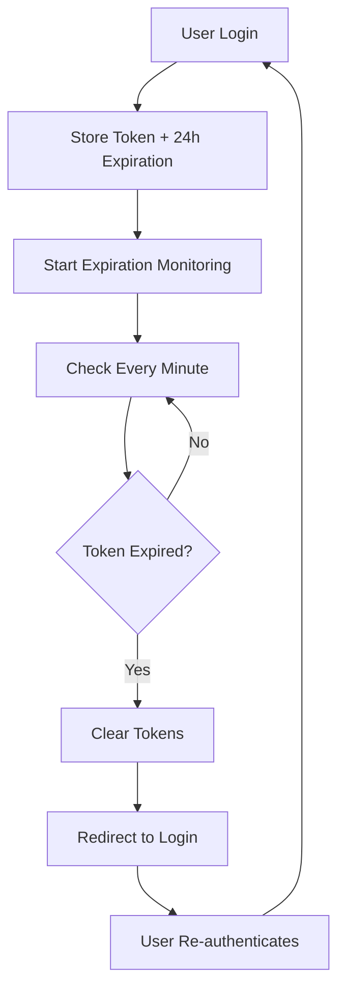

# Authentication Flow & Token Expiration Handling

## 🔐 **Overview**

The Operations app now has a **proactive authentication system** that continuously monitors token validity and automatically redirects users to login when tokens expire.

## 🚀 **How It Works**

### **1. Token Storage with Expiration**
- **Long tokens** are automatically assigned a 24-hour expiration time
- **Expiration timestamp** is stored alongside the token data
- **Automatic cleanup** when tokens expire

### **2. Proactive Token Monitoring**
- **Continuous checking** every minute for token expiration
- **Automatic redirect** to login when tokens expire
- **No waiting** for API calls to fail

### **3. Multiple Authentication Layers**
- **TokenManager**: Handles token storage and expiration
- **ProtectedRoute**: Monitors authentication status continuously
- **API Client**: Handles 401 responses gracefully

## 🔄 **Authentication Flow**



## 📋 **Components & Responsibilities**

### **TokenManager** (`packages/ui/libs/auth/tokenManager.ts`)
- ✅ **Token Storage**: Stores tokens with expiration timestamps
- ✅ **Expiration Checking**: Monitors tokens every minute
- ✅ **Automatic Cleanup**: Clears expired tokens
- ✅ **Smart Redirects**: Only redirects if not already on login page

### **ProtectedRoute** (`apps/chartering/src/app/components/ProtectedRoute.tsx`)
- ✅ **Initial Check**: Validates authentication on component mount
- ✅ **Continuous Monitoring**: Checks auth status every 30 seconds
- ✅ **Graceful Redirects**: Redirects to login when auth is lost
- ✅ **Login Page Handling**: Doesn't interfere with login page

### **API Client** (`packages/ui/libs/api-client.ts`)
- ✅ **Token Injection**: Automatically adds tokens to API requests
- ✅ **401 Handling**: Clears tokens on authentication failures
- ✅ **No Conflicts**: Works with ProtectedRoute without redirect conflicts

## 🎯 **Token Expiration Scenarios**

### **Scenario 1: Token Expires During Active Session**
1. **User is working** on a page
2. **Token expires** (after 24 hours)
3. **TokenManager detects** expiration within 1 minute
4. **Tokens are cleared** automatically
5. **ProtectedRoute detects** auth loss within 30 seconds
6. **User is redirected** to login page

### **Scenario 2: API Call with Expired Token**
1. **User makes** an API call
2. **Server returns** 401 (Unauthorized)
3. **API Client clears** tokens
4. **ProtectedRoute detects** auth loss
5. **User is redirected** to login page

### **Scenario 3: Page Refresh with Expired Token**
1. **User refreshes** the page
2. **ProtectedRoute checks** authentication
3. **TokenManager validates** token expiration
4. **User is immediately** redirected to login

## ⚡ **Performance & Efficiency**

- **Minimal overhead**: Token checks happen in background
- **Smart intervals**: 1-minute token checks, 30-second auth monitoring
- **Automatic cleanup**: Intervals are cleared when components unmount
- **No duplicate redirects**: Multiple systems work together without conflicts

## 🔧 **Configuration**

### **Token Expiration Time**
```typescript
// Default: 24 hours
const expiresAt = Date.now() + (24 * 60 * 60 * 1000);
```

### **Check Intervals**
```typescript
// Token expiration check: every 1 minute
setInterval(..., 60000);

// Authentication monitoring: every 30 seconds  
setInterval(..., 30000);
```

## 🚨 **Error Handling**

### **Graceful Degradation**
- **Network failures** don't break authentication
- **API errors** are handled without crashes
- **Token corruption** results in automatic logout

### **User Experience**
- **No sudden crashes** when tokens expire
- **Smooth redirects** to login page
- **Clear feedback** about authentication status

## ✅ **Benefits**

1. **Proactive Security**: Tokens are validated before they expire
2. **Better UX**: Users aren't surprised by failed API calls
3. **Consistent Behavior**: All authentication paths work the same way
4. **No Conflicts**: Multiple systems work together seamlessly
5. **Automatic Cleanup**: Expired tokens are removed automatically

## 🔍 **Testing the System**

### **Test Token Expiration**
1. **Login** to the Operations app
2. **Wait** for token to expire (or manually modify expiration time)
3. **Observe** automatic redirect to login
4. **Verify** tokens are cleared from localStorage

### **Test API 401 Handling**
1. **Login** to the Operations app
2. **Manually clear** tokens from localStorage
3. **Make** an API call
4. **Observe** graceful handling and redirect

## 🎉 **Result**

**Token expiration now redirects users to login automatically** without waiting for API calls to fail, providing a much better user experience and more secure authentication system.
